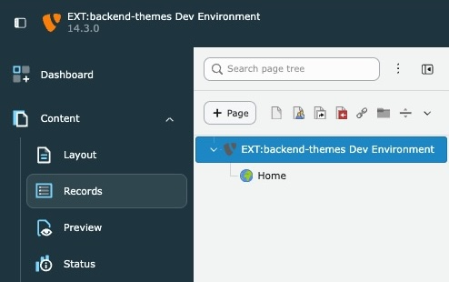

<div align="center">


# TYPO3 extension `backend_themes`

[](https://extensions.typo3.org/extension/backend_themes)
[](https://github.com/konradmichalik/typo3-backend-themes/actions/workflows/cgl.yml)
[](https://github.com/konradmichalik/typo3-backend-themes/actions/workflows/tests.yml)
[](LICENSE)

</div>

TYPO3 v14 extension to create custom backend color themes. Define primary and secondary colors, configure dark mode overrides, and let backend users choose their preferred theme.



## ✨ Features

- **Custom color themes** as database records (root level)
- **Primary color** controls icons, accents, and UI elements across the entire backend
- **Secondary color** for header and sidebar background (auto-derived from primary if left empty)
- **Dark mode overrides** for fine-grained control over dark color scheme
- **Live preview** when editing theme records (light + dark mode side by side)
- **User Settings integration** as single dropdown alongside TYPO3 default themes (Fresh, Modern, Classic)
- **Default theme** marking for admin-recommended themes
- **Reload notification** after theme changes (FlashMessage)

## 📋 Requirements

| Component | Version |
|-----------|---------|
| TYPO3     | 14.0+   |
| PHP       | 8.2+    |

## 📦 Installation

```bash
composer require konradmichalik/typo3-backend-themes
```

## 🎨 Configuration

### Creating Themes

1. Open the **List** module at **root level** (pid=0)
2. Create a new **Backend Theme** record
3. Set a **title** and choose a **primary color**
4. Save — the live preview shows light and dark mode side by side


> [!TIP]
> Check **Default Theme** to mark it as the admin-recommended theme. It will appear at the top of the user dropdown with "(Default)" suffix.

### Theme Fields

| Field | Required | Description |
|-------|----------|-------------|
| Title | Yes | Display name (e.g. "Corporate Blue") |
| Primary Color | Yes | Main accent color — controls icons, buttons, links |
| Default Theme | No | Mark as recommended theme for all users |

#### Overrides (optional)

| Field | Description |
|-------|-------------|
| Secondary Color | Header/sidebar background. If empty, automatically derived from primary color via CSS `hsl()` |
| Primary Color (Dark Mode) | Override for icons and accents in dark mode |
| Secondary Color (Dark Mode) | Override for header/sidebar in dark mode |

> [!NOTE]
> All override fields are optional. When left empty, colors are automatically derived using CSS `light-dark()` and `hsl()` functions.

### User Settings

Users select their theme under **User Settings → Appearance → Theme**:


Standard TYPO3 themes continue to work as before. Custom themes apply color overrides via CSS custom properties.

## 🔧 How It Works

The extension uses a PSR-15 middleware to inject CSS custom properties into every backend request (including the content iframe). The generated CSS overrides TYPO3's design token system:

```css
html[data-theme] {
    --token-color-primary-base: #3B82F6;
    --typo3-scaffold-header-bg: light-dark(...);
    --typo3-scaffold-sidebar-bg: light-dark(...);
}

html[data-theme] .icon,
html[data-theme] typo3-backend-icon {
    --icon-color-accent: light-dark(hsl(from #3B82F6 h s 55%), ...);
}
```

> [!IMPORTANT]
> After changing a theme in User Settings or editing theme colors, a **full page reload** is required. The extension shows a FlashMessage reminder.

## 🌗 Dark Mode

Fully supported via TYPO3's `[data-color-scheme="dark"]` selector.

**Automatic:** When no dark mode overrides are configured, colors adjust automatically using CSS `light-dark()`.

**Manual:** Configure explicit dark mode colors for fine-grained control:
- **Primary Color (Dark Mode)** — overrides `--token-color-primary-base`
- **Secondary Color (Dark Mode)** — overrides header/sidebar backgrounds

## 🤝 Contributing

See [CONTRIBUTING.md](CONTRIBUTING.md) for development setup, linting, testing and pull request guidelines.

## 📁 Architecture

```
Classes/
├── Backend/Form/
│   ├── Element/ThemePreviewElement.php   # TCA live preview (fieldWizard)
│   └── ItemsProcFunc/ThemeItemsProcFunc.php  # Adds custom themes to user dropdown
├── Hook/DataHandlerHook.php              # Enforces single default, reload message
├── Middleware/
│   ├── ThemeCssInjectionMiddleware.php   # Injects CSS into main + iframe
│   └── ThemeChangeNotificationMiddleware.php  # FlashMessage on theme change
└── Service/
    ├── CssGenerator.php                  # Generates CSS custom properties
    └── ThemeService.php                  # Database access, theme resolution
```

## 📄 License

GPL-2.0-or-later
