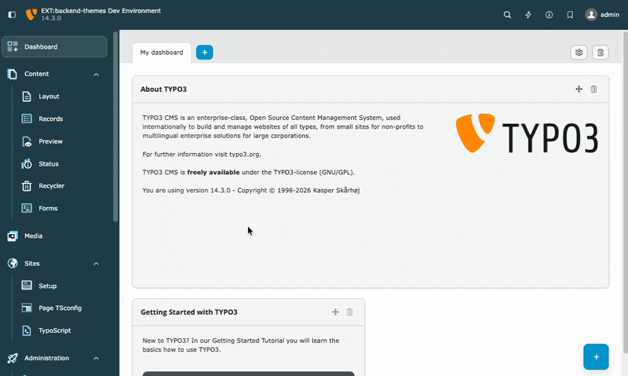
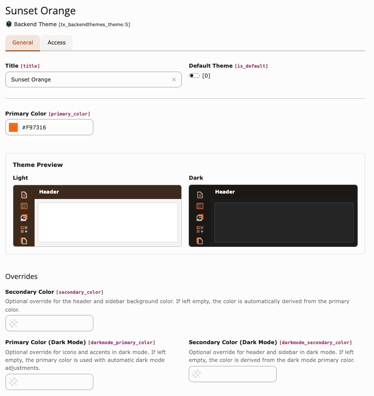
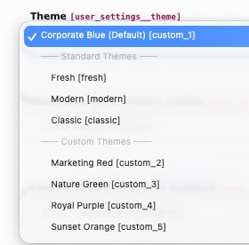

<div align="center">


# TYPO3 extension `backend_themes`

[](https://extensions.typo3.org/extension/backend_themes)
[](https://extensions.typo3.org/extension/backend_themes)
[](https://packagist.org/packages/konradmichalik/typo3-backend-themes)

[](https://github.com/konradmichalik/typo3-backend-themes/actions/workflows/cgl.yml)
[](https://github.com/konradmichalik/typo3-backend-themes/actions/workflows/tests.yml)
[](LICENSE)

</div>

TYPO3 v14 extension to create custom backend color themes. Define primary and secondary colors, configure dark mode overrides, and let backend users choose their preferred theme.

> [!NOTE]
> Use this extension to subtly establish your project or client branding in the TYPO3 backend. For example, apply corporate colors to the sidebar, header and icons so editors immediately recognize which installation they are working in.

!

## ✨ Features

- Custom color themes as database records with live preview
- Dark mode support with optional overrides
- User Settings integration alongside TYPO3 default themes
- Admin-defined default theme recommendation

> [!WARNING]
> This is an experimental extension. TYPO3 v14 introduced the [Fresh theme](https://docs.typo3.org/c/typo3/cms-core/main/en-us/Changelog/14.0/Feature-108240-IntroduceFreshTheme.html) and the backend theming approach based on CSS custom properties and design tokens is expected to evolve further in upcoming TYPO3 core releases. This extension builds on top of that system and may require adjustments as the core API matures.

## 🔥 Installation

### Requirements

| TYPO3  | PHP       |
|--------|-----------|
| 14.0+  | 8.2 - 8.5 |

### Composer

[](https://packagist.org/packages/konradmichalik/typo3-backend-themes)
[](https://packagist.org/packages/konradmichalik/typo3-backend-themes)

```bash
composer require konradmichalik/typo3-backend-themes
```

### TER

[](https://extensions.typo3.org/extension/backend_themes)
[](https://extensions.typo3.org/extension/backend_themes)

Download the zip file from [TYPO3 extension repository (TER)](https://extensions.typo3.org/extension/backend_themes).

## 🎨 Configuration

### Creating Themes

1. Open the **List** module at **root level** (pid=0)
2. Create a new **Backend Theme** record
3. Set a **title** and choose a **primary color**
4. Save — the live preview shows light and dark mode side by side



> [!TIP]
> Check **Default Theme** to mark it as the admin-recommended theme. It will appear at the top of the user dropdown with "(Default)" suffix.

### User Settings

Users select their theme under **User Settings → Appearance → Theme**:



Standard TYPO3 themes continue to work as before. Custom themes apply color overrides via CSS custom properties.

> [!IMPORTANT]
> After changing a theme in User Settings or editing theme colors, a **full page reload** is required. The extension shows a FlashMessage reminder.

## 🤝 Contributing

See [CONTRIBUTING.md](CONTRIBUTING.md) for development setup, linting, testing and pull request guidelines.

## 📄 License

GPL-2.0-or-later
